<div align="center">
  
</div>


<div align="center">

| project | stack | |
|---|---|---|
| [bino](https://github.com/abubakkersiddiqq/bino_smart_query_helper) | Go · OpenRouter · REST | [↗ live](https://bino-smart-query-helper.onrender.com) |
| [blogflow-api](https://github.com/abubakkersiddiqq/real-blog) | FastAPI · PostgreSQL · Docker · Supabase · JWT | [↗ live](https://real-blog.onrender.com) |
| [deep-reader](https://github.com/abubakkersiddiqq/deep-reader) | FastAPI · RAG · pgvector · Docker | [↗ live](https://deepreader.onrender.com) |

</div>

<br/>

<div align="center">

[GitHub](https://github.com/abubakkersiddiqq) &nbsp;·&nbsp; [LinkedIn](https://www.linkedin.com/in/abubakker-siddiq-715759231/) &nbsp;·&nbsp; [Email](mailto:abubakkerconnect@gmail.com)

</div>

---

<div align="center">

```
# python backend  |  ai integration  |  open to hire
# if you're building something real — let's talk
```

</div>
